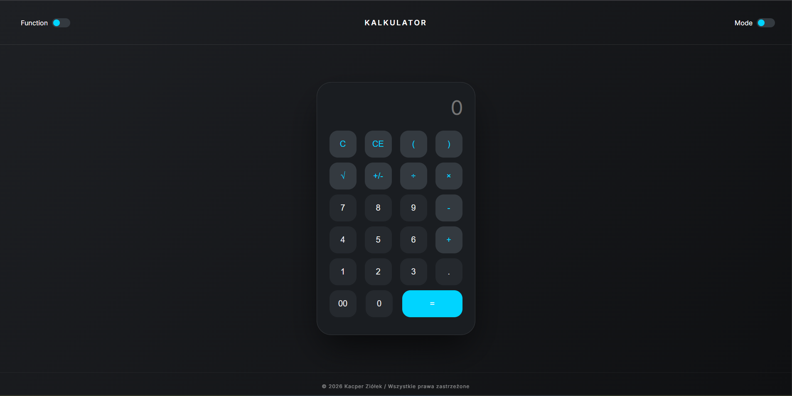
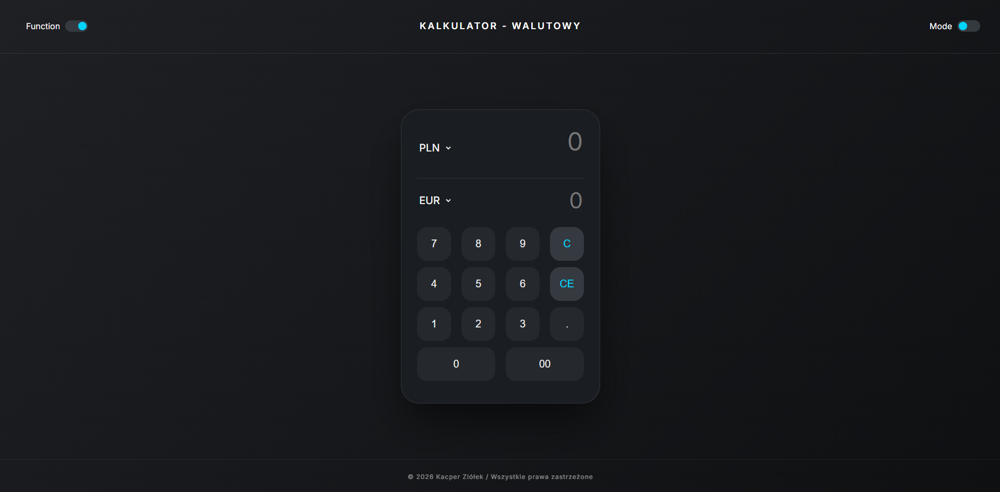

# Wielofunkcyjny Kalkulator (Standardowy & Walutowy)

Nowoczesna aplikacja webowa napisana w czystym HTML, CSS i JavaScript, oferująca dwa w pełni funkcjonalne moduły: zaawansowany kalkulator matematyczny oraz kalkulator walutowy pobierający kursy na żywo.

Projekt wyróżnia się estetycznym interfejsem (Neumorphism), płynnymi przejściami oraz świetnym User Experience (obsługa klawiatury, przełączniki motywów i trybów).

##  Funkcje

* **Dwa tryby pracy (Function Toggle):** Płynne przełączanie między kalkulatorem standardowym a modułem walutowym.
* **Kalkulator Walutowy (Live API):** Przeliczanie dziesiątek walut (PLN, EUR, USD, GBP, JPY i inne) w czasie rzeczywistym. Kursy są pobierane asynchronicznie z oficjalnego **API Narodowego Banku Polskiego (NBP)**.
* **Kalkulator Matematyczny:** Obsługa podstawowych działań, nawiasów, pierwiastkowania (`√`) oraz szybkiej zmiany znaku (`+/-`).
* **Dark / Light Mode:** Wbudowany, płynny przełącznik motywu jasnego i ciemnego, oparty na zmiennych CSS.
* **Obsługa z klawiatury:** Możliwość wprowadzania liczb, wykonywania działań (Enter) oraz czyszczenia pamięci (Backspace, Escape/C) bezpośrednio z klawiatury fizycznej komputera.

##  Wygląd aplikacji 

| Kalkulator Standardowy | Kalkulator Walutowy |
| :---: | :---: | 
|  |  |

##  Technologie

* **HTML5** (Semantyczna struktura, podział na sekcje)
* **CSS3** (Zmienne globalne `:root`, Flexbox, customowe przełączniki stylizowane od zera)
* **JavaScript (ES6+)**
  * Manipulacja DOM i nasłuchiwanie zdarzeń (`addEventListener`).
  * Obsługa asynchroniczności (`async / await`, `Fetch API`).
  * Przechwytywanie zdarzeń klawiatury (`keydown`).

##  Struktura projektu

Projekt został podzielony na logiczne katalogi dla zachowania czystości kodu:

* `index.html` – Moduł kalkulatora matematycznego.
* `funkcje.html` – Moduł kalkulatora walutowego z selektorami walut.
* `css/style.css` – Główne style aplikacji, motywy i układ podstawowego kalkulatora.
* `css/style_2.css` – Specyficzne style dedykowane dla wyświetlaczy walutowych.
* `js/script.js` – Logika operacji matematycznych, obsługa klawiatury i zmiana motywów.
* `js/scrpit_2.js` – Logika pobierania danych z API NBP i matematyka przeliczania kursów.

##  Podgląd na żywo (GitHub Pages)

Możesz przetestować obie funkcje kalkulatora bezpośrednio w przeglądarce:
**[ Przetestuj Kalkulator](https://ziollo.github.io/kalkulator/)**
