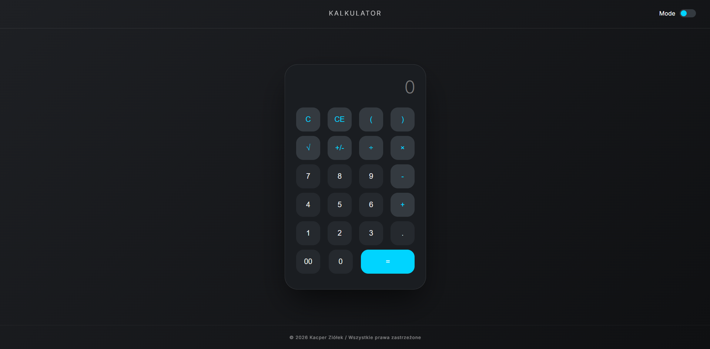
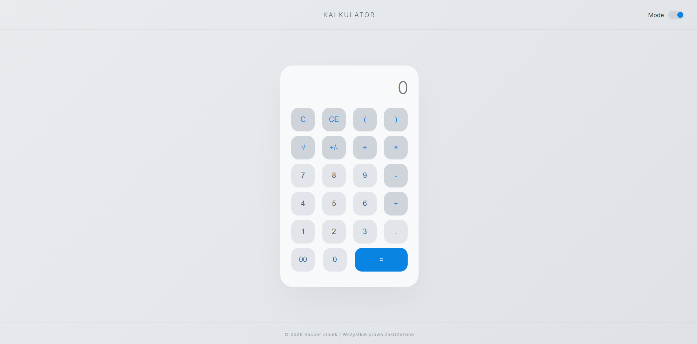

# Nowoczesny Kalkulator Webowy

Estetyczny i w pełni responsywny kalkulator działający w przeglądarce, napisany od zera w technologiach front-endowych (HTML, CSS, JavaScript). 

Projekt wyróżnia się nowoczesnym designem (tzw. Neumorphism/Glassmorphism) oraz płynnie działającym przełącznikiem motywów (Dark Mode / Light Mode). W najbliższej przyszłości aplikacja **zostanie rozbudowana o moduł kalkulatora walutowego**, pobierający aktualne kursy z zewnętrznego API.

##  Funkcje

* **Zaawansowane operacje:** Oprócz podstawowych działań (+, -, *, /) kalkulator obsługuje potęgowanie/pierwiastkowanie (`√`), nawiasy do ustalania kolejności działań oraz szybką zmianę znaku (`+/-`).
* **Dark / Light Mode:** Wbudowany, płynny przełącznik motywu jasnego i ciemnego, oparty na natywnych zmiennych CSS (Custom Properties).
* **Czyszczenie pamięci:** Przyciski `C` (całkowite czyszczenie) oraz `CE` (kasowanie ostatniego znaku - Backspace).
*  **W planach (Kalkulator Walutowy):** Moduł pozwalający na przeliczanie walut w czasie rzeczywistym.

##  Wygląd aplikacji 
*(Dodaj zrzuty ekranu do folderu w repozytorium i podmień ścieżki poniżej)*

| Tryb Ciemny (Dark Mode) | Tryb Jasny (Light Mode) |
| :---: | :---: | 
|  |  |

##  Technologie

* **HTML5** (Struktura widoku)
* **CSS3** (Zmienne globalne `:root`, Flexbox, płynne animacje `transition`, Google Fonts)
* **JavaScript (ES6+)** (Manipulacja drzewem DOM, logika matematyczna, obsługa motywów)

##  Struktura projektu

* `index.html` – Główny plik strukturalny zawierający interfejs kalkulatora i przełącznik motywu.
* `style.css` – Arkusz stylów definiujący wygląd, kolory dla obu motywów oraz animacje przycisków.
* `script.js` – Logika operacji matematycznych oraz funkcja nasłuchująca zmiany motywu.

##  Podgląd na żywo (GitHub Pages)

Możesz przetestować działanie kalkulatora (i kliknąć przełącznik motywu!) bezpośrednio w przeglądarce:
**[ Przetestuj Kalkulator](https://ziollo.github.io/kalkulator/)**
